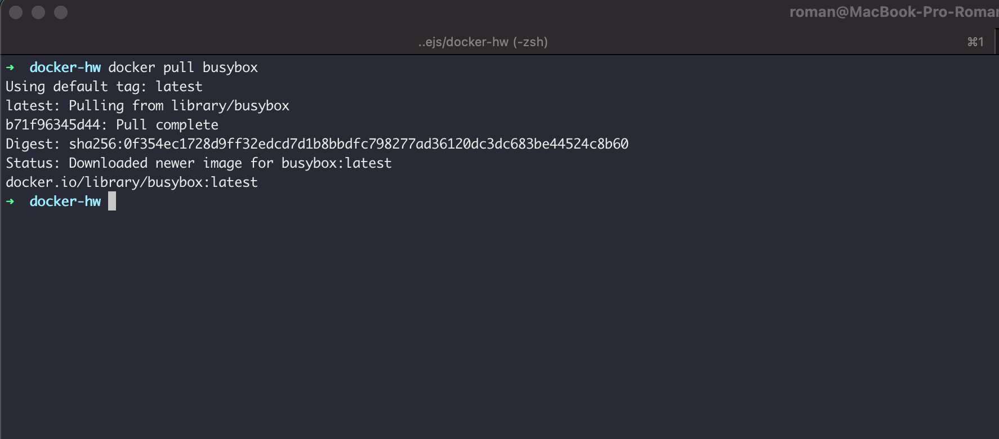
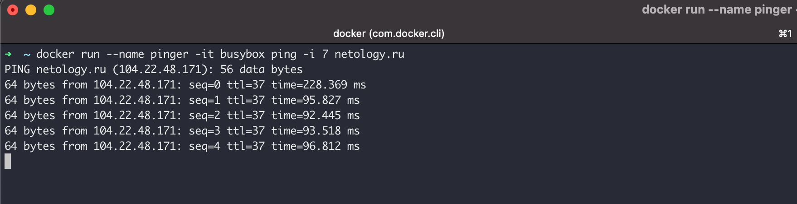
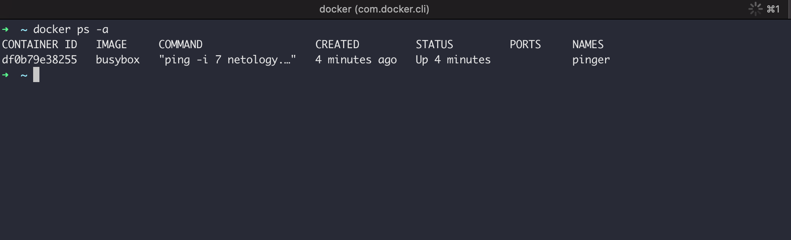
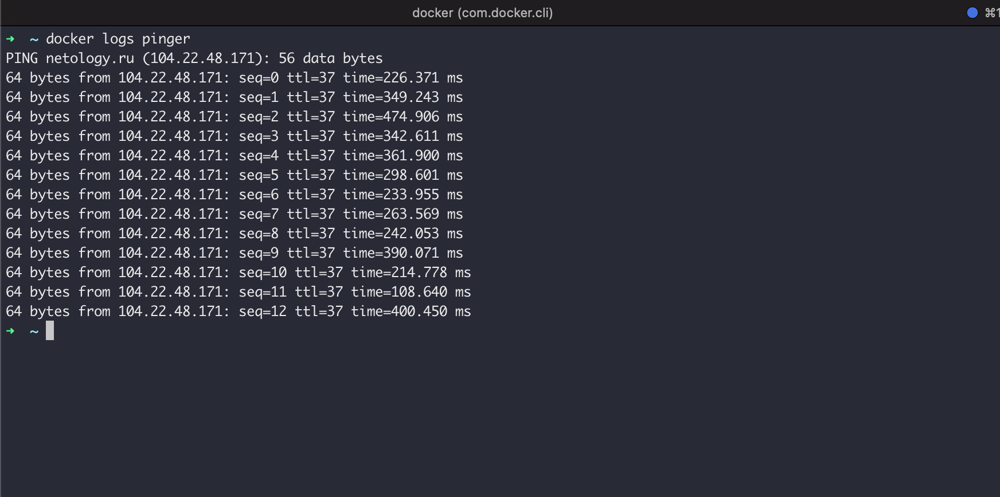
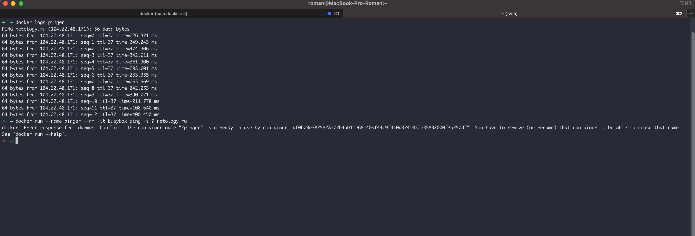
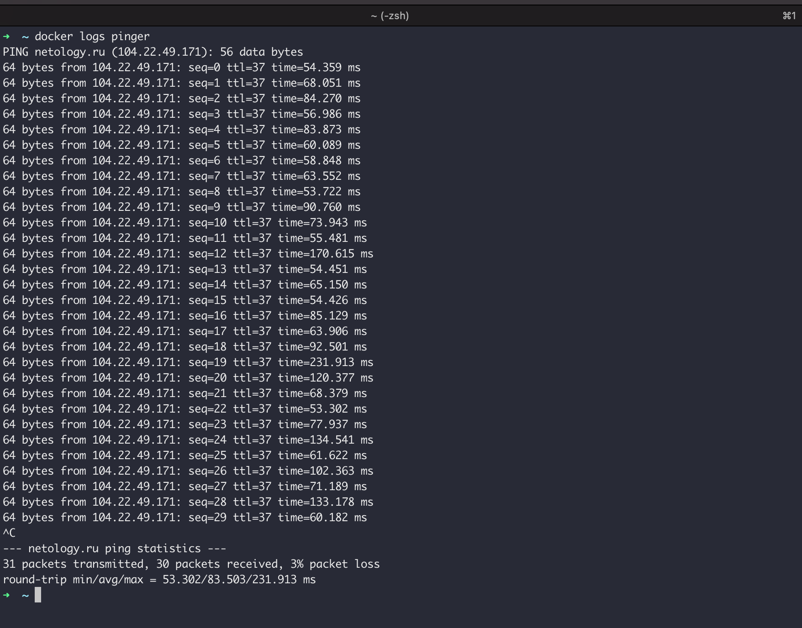
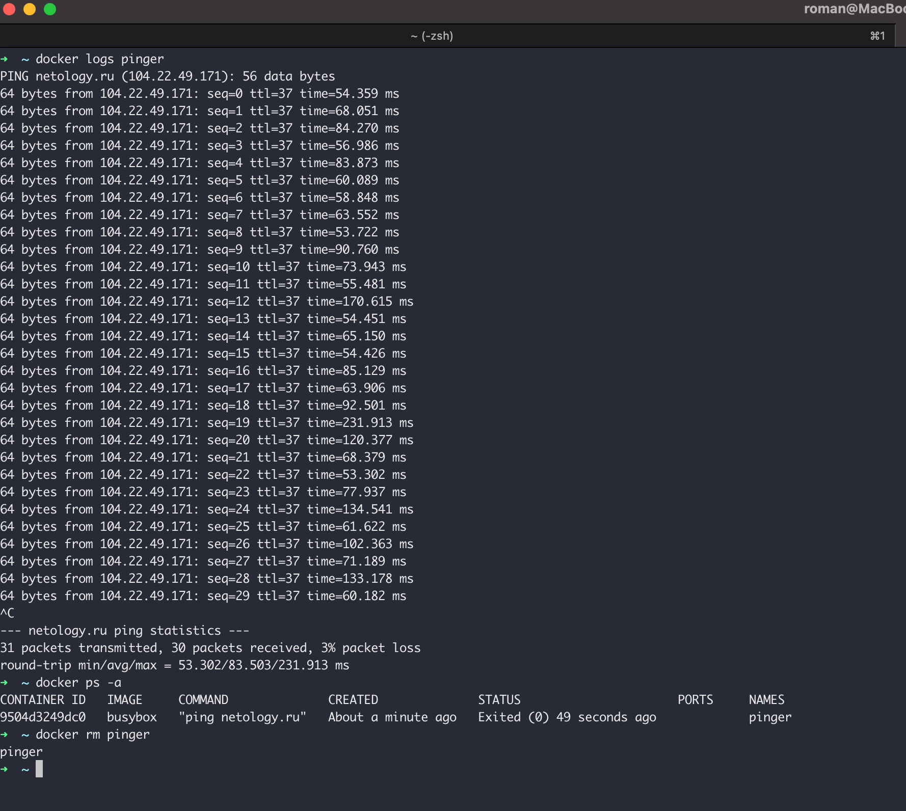
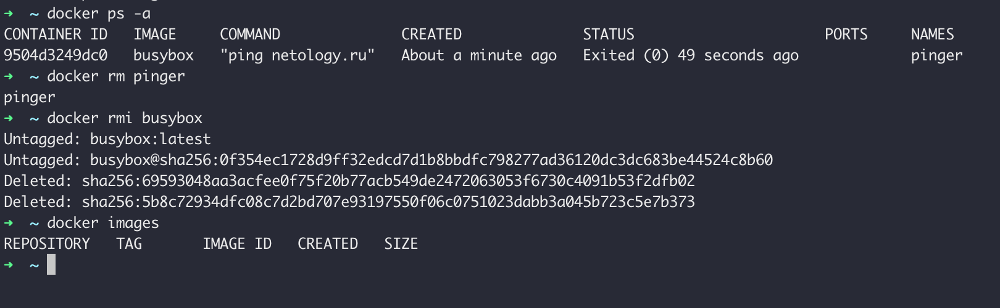

## Задание 1 - Docker CLI
1. Загрузите образ `busybox` последней версии

2. Запустите новый контейнер `busybox` с командой `ping` сайта `netology.ru`, и количеством пингов 7, поименуйте контейнер `pinger`

3. Выведите на список всех контейнеров - запущенных и остановленных

4. Выведите на экран логи контейнера с именем `pinger`

5. Запустите второй раз контейнера с именем `pinger`

6. Выведите на список всех контейнеров - запущенных и остановленных

7. Выведите на экран логи контейнера с именем `pinger`
8. Определите по логам общее количество запусков команды `ping` и какое общее количество отправленых запросов

9. Удалите контейнер с именем `pinger`

10. Удалите образ `busybox`

