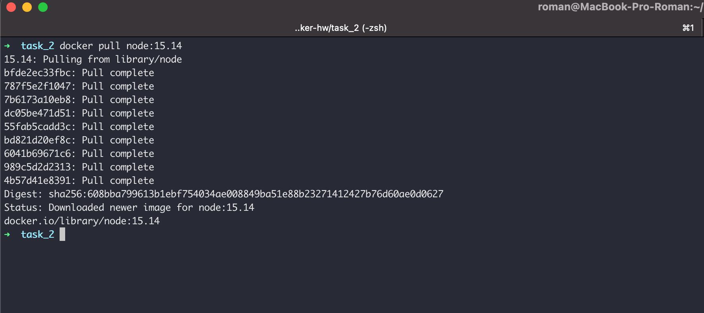
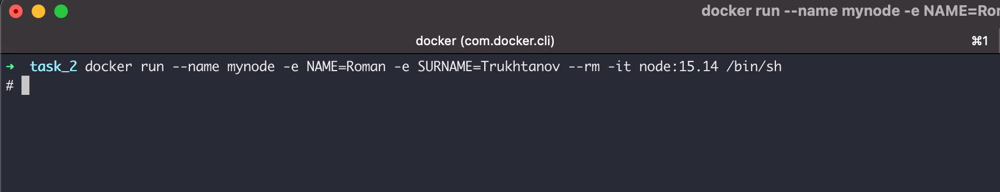
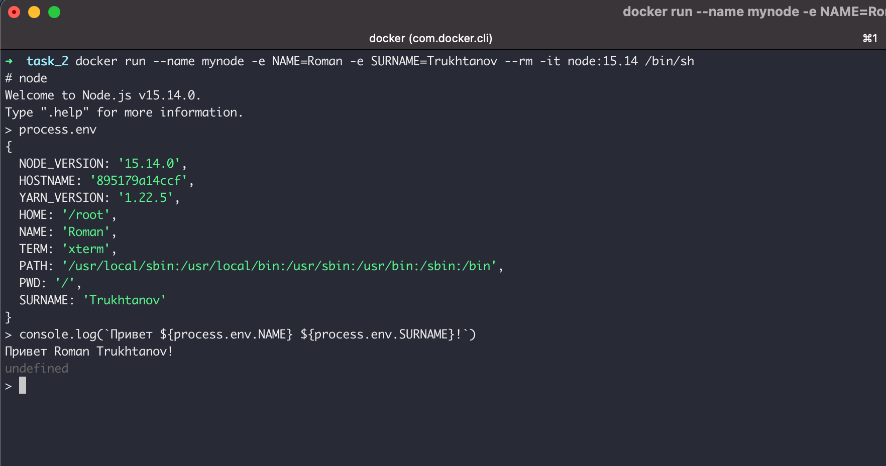
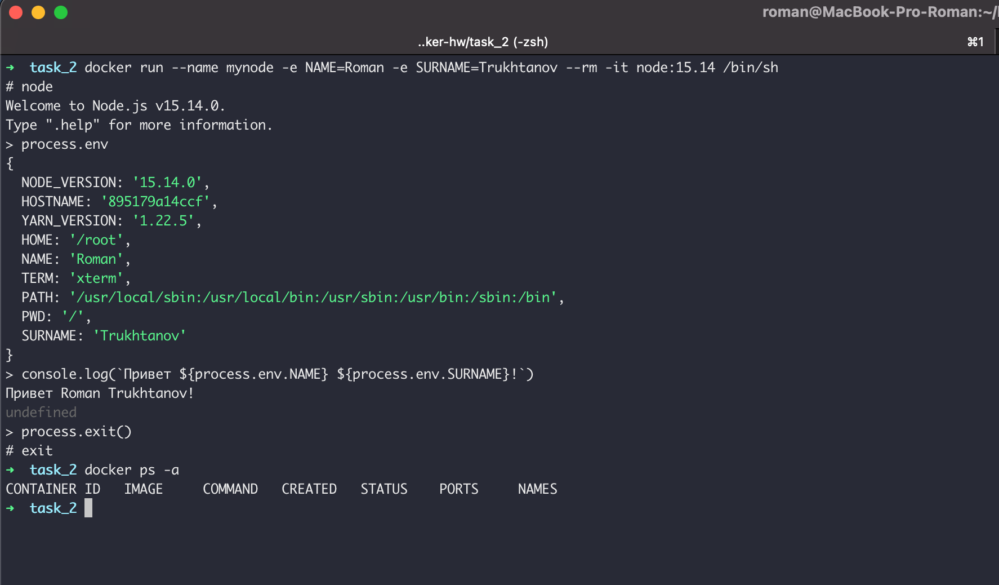
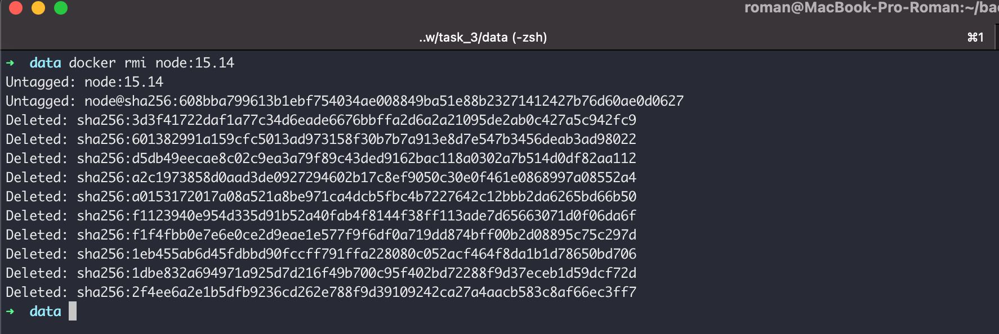

## Задание 2 - Environment Variables
1. Загрузите образ node версии 15.14

2. Запустите контейнер node в интерактивном режиме подключения терминала, поименуйте его `mynode`, передайте две переменные среды `NAME=<ваше имя>` и `SURNAME=<ваша фамилия>`

3. В интерактивной среде выполнения node выполните скрипт, который выведет на экран приветсвтие: `Привет, <ваше имя> <ваша фамилия>!`, эти данные должны быть получены из переменных среды

4. Остановите контейнер

5. Удалите образ node версии 15.14

