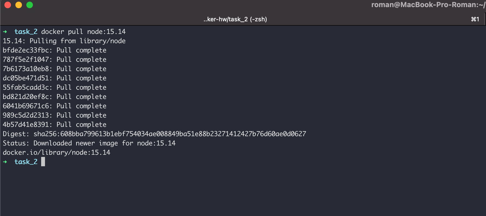
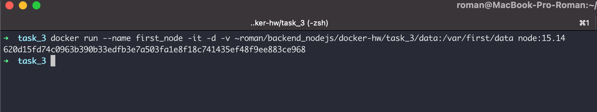
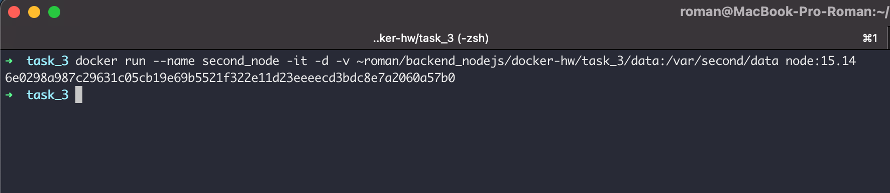
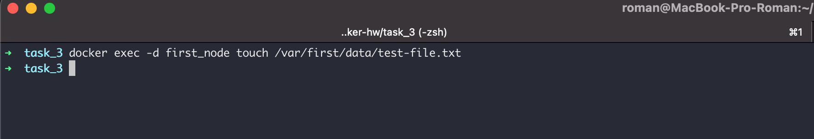
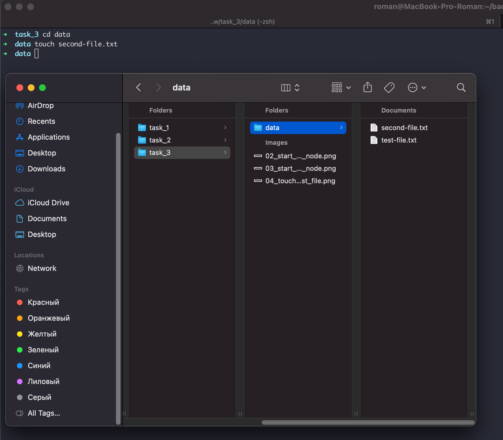
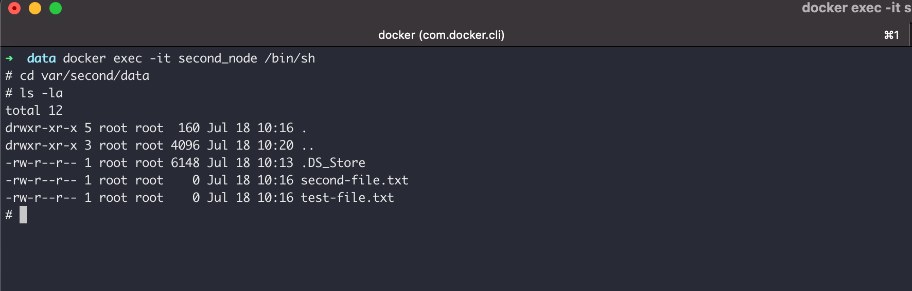
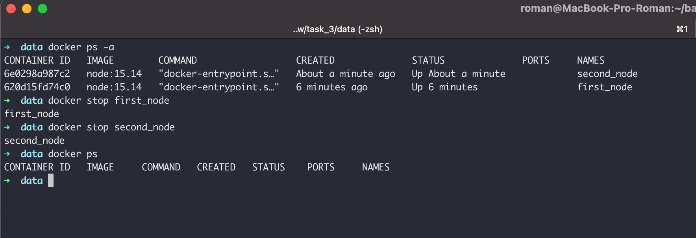
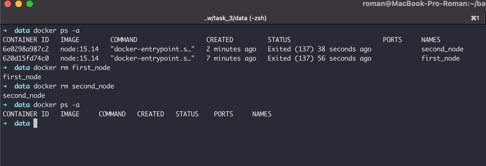

## Задание 2 - Environment Variables
1. Загрузите образ node версии 15.14

2. Запустите контейнер с именем `first_node` из образа node версии 15.14 в фоновом режиме, подключив папку `data` из текущей директории в `/var/first/data` контейнера

3. Запустите контейнер с именем `second_node` из образа node версии 15.14 в фоновом режиме, подключив папку `data` из текущей директории в `/var/second/data` контейнера

4. Подключитесь к контейнеру `first_node` с помощью exec и создайте текстовый файл любого содержания в `/var/first/data`

5. Добавьте еще один файл в папку `data` на хостовой машине

6. Подключитесь к контейнеру `second_node` с помощью `exec` и получите список файлов в директории `/var/second/data`, выведете на экран содержимое файлов

7. Остановите оба контейнера

8. Удалите оба контейнера

9. Удалите образ node версии 15.14

